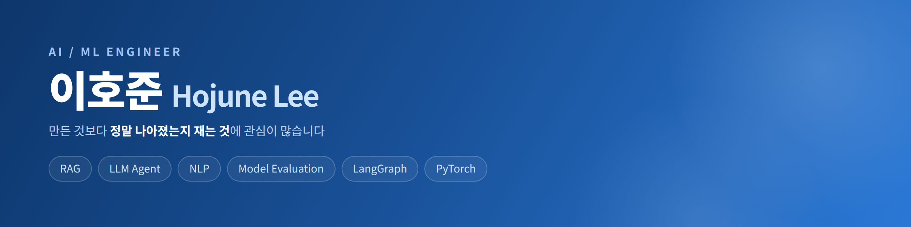
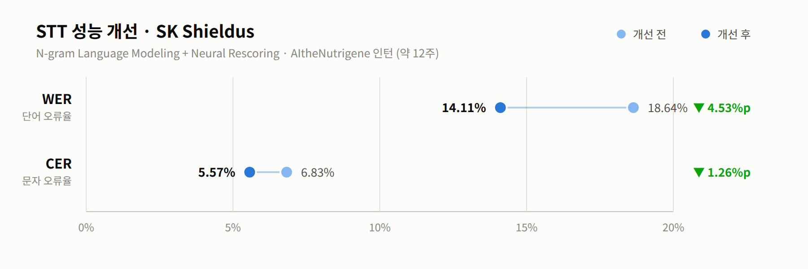
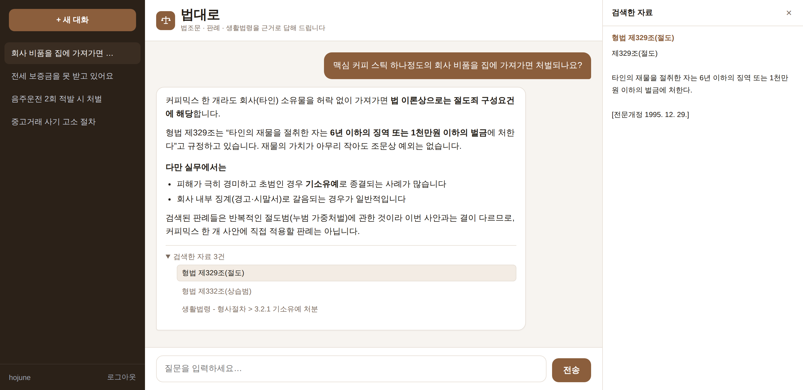
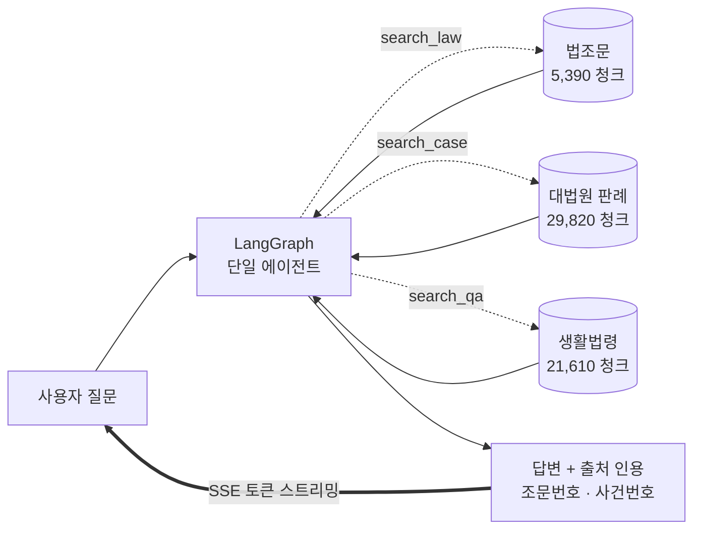
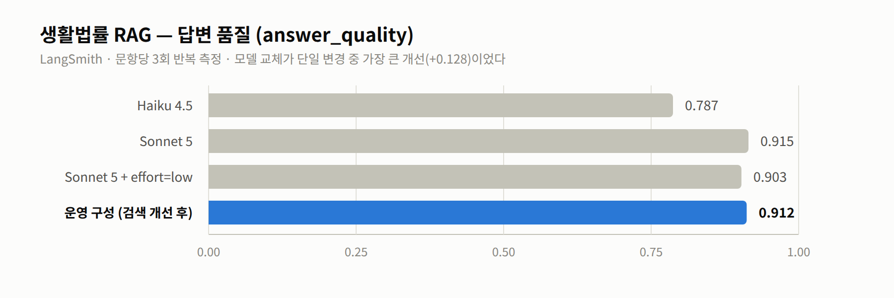
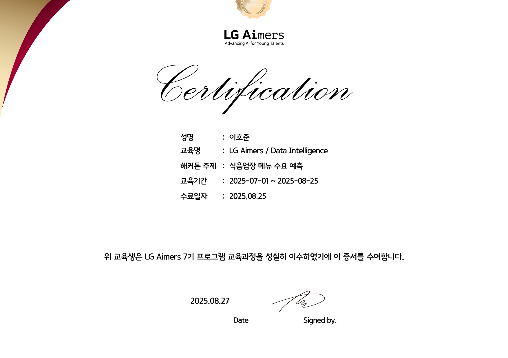

  

  
  
  

---

## 👋 About Me

음성 인식(STT)과 음성 합성(TTS)에서 시작해, 지금은 **RAG와 LLM 에이전트**를 만들고 있습니다.

성능을 "올렸다"고 말하려면 먼저 재봐야 한다고 생각합니다. 생활법률 RAG를 만들 때 프롬프트를 고칠 때마다 점수가 오르내렸는데, 문항당 3회씩 반복 측정해 보니 **그 등락의 대부분이 노이즈**였습니다. 그 뒤로는 개선을 주장하기 전에 평가 파이프라인부터 세웁니다.

| | |
|---|---|
| 🎓 | **숭실대학교 소프트웨어학부** (2020.03 ~ 2026.02) |
| 🚀 | **카카오테크 부트캠프 AI 실무개발 4기** (2026.05 ~ ) |
| 🎖️ | 해병대 1263기 병장 만기전역 (2020.10 ~ 2022.04) |
| 🔬 | RAG Architecture · Agent Systems · LLM Fine-tuning · Evaluation |

---

## 🏆 KTB 4기 AI 성능 개선 대회 — 최우수상

> **카카오 약관 QA 시스템** · 13팀 ·  **88.889 / 100**
> 검색 MRR `1.0000` · 키팩트 F1 `0.6721` · LLM 판정 `97.450`
> 공개 10문항 검색 recall **12/12** · precision **12/12**

카카오 약관 4종에서 질문에 해당하는 조항을 찾아 **답변과 근거 조항을 함께** 반환하는 RAG입니다.
Google Colab T4 한 대, 외부 API 없이 동작합니다. → [저장소 보기](https://github.com/HojuneLee0106/Performance_Improvement_Contest)

---

## 💼 Experience

### AItheNutrigene · AI/ML 인턴 2024.12 ~ 2025.02

**SK Shieldus STT 성능 개선 프로젝트** (약 12주) — `Python` `NVIDIA NeMo` `KenLM`

<picture>
  <source media="(prefers-color-scheme: dark)" srcset="assets/stt-improvement-dark.png">
  
</picture>

N-gram Language Modeling으로 도메인 어휘를 반영하고, Neural Rescoring으로 후보 문장을 다시 정렬해 인식 오류를 줄였습니다.

---

## 🚀 Projects

### ⚖️ [생활법률 RAG 챗봇 "법대로"](https://github.com/HojuneLee0106/online_law)

법조문 · 대법원 판례 · 생활법령을 근거로 답하는 법률 Q&A 어시스턴트.
답변의 조문 번호와 사건번호를 **원문에서 그대로 가져와** 인용합니다.

 

**아키텍처**

한 턴에 세 도구를 **병렬 호출**하므로 도구를 3개 쓰는 질문도 LLM 왕복은 2회뿐입니다.

 

**무엇을 재고 어떻게 정했나**

<picture>
  <source media="(prefers-color-scheme: dark)" srcset="assets/rag-quality-dark.png">
  
</picture>

| | |
|---|---|
| **Stack** | LangGraph · Chroma · FastAPI(SSE) · Docker → GHCR → EC2 |
| **Eval** | `answer_quality 0.912` · `citation_grounding 0.984` · `tool_recall 1.000` |
| **설계** | LangSmith로 단일/멀티 에이전트 3개 구조를 비교한 뒤 single 채택 |

검색 인프라를 총동원한 개선이 **+0.031**이었던 반면, 모델 교체 한 번이 **+0.128**로 4배 컸습니다.
반대로 1회 실행 측정으로는 개선과 노이즈를 구분할 수 없다는 것도 같이 배웠습니다.

 

### 🔊 AI Docent Studio 캡스톤디자인 · 2025.09 ~ 2025.12

사용자 맞춤형 **TTS 모델(VITS)** 제작. 도슨트 음성을 개인화하는 프로젝트로, **RISE 사업 체결**로 이어졌습니다.

`VITS` `PyTorch` `Speech Synthesis`

 

### 🏋️ AI 헬스 자세 교정 어플리케이션 캡스톤디자인 · 2025.03 ~ 2025.06

**QLoRA** 기법으로 파인튜닝한 헬스케어 맞춤 챗봇. 운동 도메인에 특화된 응답을 생성하도록 경량 학습했습니다.

`QLoRA` `PEFT` `FastAPI`

 

### 🧠 [miniGPT · 한국어 QA](https://github.com/HojuneLee0106/Chatbot)

GPT 구조를 처음부터 직접 구현해 한국어 QA 데이터로 학습.
`CausalSelfAttention`부터 학습 루프까지 라이브러리 없이 짜면서 트랜스포머 내부를 이해하는 게 목적이었습니다.

| | |
|---|---|
| **Config** | `block_size=1024` · `n_embd=512` · `n_head=8` · `n_layer=8` |
| **결과** | `val loss 3.022` (A100 80GB) |

 

### 💬 [커뮤니티 서버](https://github.com/HojuneLee0106/Community_server)

FastAPI 게시판 API. Router / Controller / Model 계층 분리 + MySQL 연동,
Ollama(`gemma2`)로 글·댓글 자동 요약을 붙였습니다.

> 200줄짜리 `main.py` 하나를 계층별로 쪼개보고 나서야, 왜 남들이 파일을 나누는지 이해했습니다.

---

## 🛠 Tech Stack

**AI / ML**

  
  
  
  
  
  
  

**LLM / RAG**

  
  
  
  
  
  

**Backend / Infra**

  
  
  
  
  
  

**Collaboration**

  
  
  
  
  
  

---

## 📊 GitHub Stats

  

---

## 🏅 Activities & Certification

### 🎓 LG Aimers 7기 · Data Intelligence 2025.07.01 ~ 2025.08.25 수료

수료증 보기

 

 

### 🏈 숭실대학교 크루세이더스 (중앙 미식축구부)

- 회장 2023.10 ~ 2024.11
- 디펜스 캡틴 2022.06 ~ 2025.12
- 2025 서울 대학 미식축구 최강자전 **디비전 2 준우승**

 

### 📜 Certification

- OPIc **IH** 2026.03
- 정보처리기사 2026.07 취득 예정
- ADSP 2026.08 취득 예정
---

